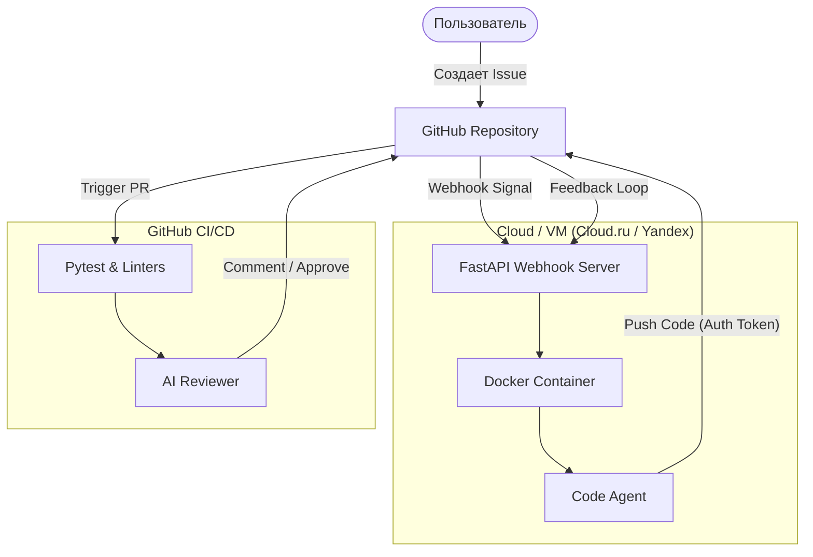

# SDLC Coding Agent: Professional Edition

[](https://python.org)
[](https://www.docker.com/)
[](https://fastapi.tiangolo.com/)
[](https://github.com/psf/black)

**Автономная мультиагентная система**, реализующая полный цикл разработки (SDLC) прямо в вашем репозитории. Система не просто пишет код, а работает как полноценный цифровой сотрудник: анализирует бизнес-логику, адаптирует тесты, проходит ревью и разворачивается в облаке.

---

## 📑 Оглавление

- [SDLC Coding Agent: Professional Edition](#sdlc-coding-agent-professional-edition)
  - [📑 Оглавление](#-оглавление)
  - [Ключевые возможности](#ключевые-возможности)
  - [Архитектура системы](#архитектура-системы)
  - [Режимы работы](#режимы-работы)
  - [Предварительная подготовка](#предварительная-подготовка)
  - [Установка и запуск](#установка-и-запуск)
    - [Настройка секретов](#настройка-секретов)
    - [Вариант 1: Облачный деплой (Webhook Server)](#вариант-1-облачный-деплой-webhook-server)
    - [Вариант 2: GitHub Actions (Serverless)](#вариант-2-github-actions-serverless)
  - [💡 Пример сценария (Бизнес-логика)](#-пример-сценария-бизнес-логика)
  - [🛡 Безопасность и надежность](#-безопасность-и-надежность)

---

## Ключевые возможности

*   **Webhook-Native:** Полноценный сервер на FastAPI для мгновенной реакции на события GitHub в облаке (Cloud.ru / Yandex Cloud).
*   **Test Evolution:** Агент обязан поддерживать покрытие: если тесты устарели или отсутствуют, он создает их с нуля в папке `tests/`.
*   **Security Rails:** Встроенная фильтрация опасных Shell-команд (запрет на `rm -rf`, `sudo`, доступ к `.env` и др.).
*   **Self-Healing JSON:** Улучшенный LLM-клиент с логикой переповторов (Retry) при получении некорректных ответов от модели.
*   **Git Auth Pro:** Безопасная авторизация через Token-in-URL, исключающая проблемы с SSH-ключами внутри Docker.

---

## Архитектура системы


```mermaid
graph TD
    User([Пользователь]) -->|"Создает Issue"| Github["GitHub Repository"]
    
    subgraph "Cloud / VM (Cloud.ru / Yandex)"
        Server["FastAPI Webhook Server"]
        Docker["Docker Container"]
        CA[Code Agent]
        
        Server --> Docker
        Docker --> CA
    end

    subgraph "GitHub CI/CD"
        Reviewer["AI Reviewer"]
        Tests["Pytest & Linters"]
    end

    Github -->|"Webhook Signal"| Server
    CA -->|"Push Code (Auth Token)"| Github
    Github -->|"Trigger PR"| Tests
    Tests --> Reviewer
    Reviewer -->|"Comment / Approve"| Github
    Github -->|"Feedback Loop"| Server
```

---

## Режимы работы

1.  **Cloud Mode (Рекомендуемый):** Приложение работает как постоянный сервис в облаке. Реагирует на веб-хуки GitHub. Максимальная скорость и автономность.
2.  **Pipeline Mode:** Запуск агентов напрямую через GitHub Actions. Не требует своей инфраструктуры, идеально для небольших проектов.

---

## Предварительная подготовка

1.  **OpenAI API Key**: GPT-4o или GPT-4o-mini.
2.  **GitHub Token**: Classic токен с правами `repo`, `workflow`, `write:packages`.
3.  **Облачная VM**: (Для Cloud Mode) Ubuntu 22.04+ с открытым портом `8000`.

---

## Установка и запуск

### Настройка секретов

Создайте `.env` на основе примера:
```ini
GH_TOKEN=ghp_your_secret_token
API_KEY=sk-your_key
REPO_NAME=YourLogin/YourProject
MODEL_NAME=gpt-4o-mini
MAX_ITERATIONS=10
```

### Вариант 1: Облачный деплой (Webhook Server)

Идеально для **Cloud.ru** или **Yandex Cloud**.

```bash
# 1. Сборка и запуск
docker-compose up -d --build

# 2. Проверка работоспособности
curl -X GET http://<your_ip>:8000/status

# 3. Регистрация Webhook в GitHub
# Payload URL: http://<your_ip>:8000/webhook
# Content type: application/json
# Events: Issues, Issue comments
```

### Вариант 2: GitHub Actions (Serverless)

Просто запушьте код. Пайплайны в `.github/workflows/` настроены на автоматический запуск Code Agent при создании Issue и AI Reviewer при создании PR.

---

## 💡 Пример сценария (Бизнес-логика)

Вместо примитивных калькуляторов, система работает с **Payment Processor Service** (`src/project_to_modify/calculator.py`).

**Типовая задача (Issue):**
> "В сервисе обработки транзакций обнаружен баг: при возврате (refund) суммы, равной 0, происходит ZeroDivisionError. Исправь логику в @src/project_to_modify/calculator.py и добавь защитные тесты."

**Результат:**
1.  **Code Agent** анализирует `PaymentProcessor`, находит деление на `amount`.
2.  Создает тест в `tests/test_calculator.py`, воспроизводящий баг.
3.  Исправляет код, добавляя валидацию бизнес-логики.
4.  Создает PR с "зелеными" тестами.

---

## 🛡 Безопасность и надежность

*   **Командный фильтр:** Агент не может выполнить деструктивные действия в ОС.
*   **Изоляция:** Весь код выполняется внутри Docker-контейнера с ограниченными правами.
*   **Консистентность:** Использование `pathlib` и строгой типизации гарантирует отсутствие ошибок при работе с файловой системой.
*   **Observability:** Полное логирование "рассуждений" агента в `agent_run.log` и консоль раннера.

---

<div align="center">
    Разработано для ИТМО МегаШкола 2026 с ❤️
</div>
