# SDLC Coding Agent

[](https://python.org)
[](https://www.docker.com/)
[](https://fastapi.tiangolo.com/)
[](https://github.com/psf/black)

**Автономная мультиагентная система**, реализующая полный цикл разработки (SDLC) прямо в вашем репозитории. Система не просто пишет код, а работает как полноценный цифровой сотрудник: анализирует бизнес-логику, адаптирует тесты, проходит ревью и разворачивается в облаке.

---

## Оглавление

- [SDLC Coding Agent](#sdlc-coding-agent)
  - [Оглавление](#оглавление)
  - [Ключевые возможности](#ключевые-возможности)
    - [Функционал Агентов](#функционал-агентов)
  - [Архитектура системы](#архитектура-системы)
  - [Режимы работы](#режимы-работы)
  - [Предварительная подготовка](#предварительная-подготовка)
  - [Развертывание и Активация](#развертывание-и-активация)
    - [Предварительная Подготовка (Обязательно)](#предварительная-подготовка-обязательно)
    - [Локальная Сборка и Проверка Контейнера (Base Setup)](#локальная-сборка-и-проверка-контейнера-base-setup)
  - [Режимы Активации](#режимы-активации)
    - [Cloud Mode (Рекомендуемый: Автономный Webhook)](#cloud-mode-рекомендуемый-автономный-webhook)
    - [Pipeline Mode (CI/CD / GitHub Actions)](#pipeline-mode-cicd--github-actions)
  - [Ручной Режим (Для отладки)](#ручной-режим-для-отладки)
  - [Пример сценария (Бизнес-логика)](#пример-сценария-бизнес-логика)
  - [Безопасность и надежность](#безопасность-и-надежность)

---

## Ключевые возможности

*   **Webhook-Native:** Полноценный сервер на FastAPI для мгновенной реакции на события GitHub в облаке (Cloud.ru / Yandex Cloud).
*   **Test Evolution:** Агент обязан поддерживать покрытие: если тесты устарели или отсутствуют, он создает их с нуля в папке `tests/`.
*   **Security Rails:** Встроенная фильтрация опасных Shell-команд (запрет на `rm -rf`, `sudo`, доступ к `.env` и др.).
*   **Self-Healing JSON:** Улучшенный LLM-клиент с логикой переповторов (Retry) при получении некорректных ответов от модели.
*   **Git Auth Pro:** Безопасная авторизация через Token-in-URL, исключающая проблемы с SSH-ключами внутри Docker.

### Функционал Агентов

| Агент | Ответственность | Ключевые Возможности |
| :--- | :--- | :--- |
| **Developer Agent** (`code_agent.py`) | Разработка и Коррекция | Анализ Issues, создание/обновление тестов, фиксация багов, генерация коммитов и Pull Requests. |
| **Reviewer Agent** (`ai_reviewer.py`) | Контроль Качества | Анализ Diff, проверка результатов CI/CD, сравнение с требованиями Issues, публикация вердикта (`APPROVED` / `CHANGES_REQUESTED`). |
| **Петля** | Оркестрация | Запуск Code Agent в ответ на комментарий `AI Code Review` от Reviewer'а (Автономная самокоррекция). |


---

## Архитектура системы

```mermaid
graph TD
    User([Пользователь]) -->|"Создает Issue"| Github["GitHub Repository"]
    
    subgraph "Cloud / VM (Cloud.ru / Yandex)"
        Server["FastAPI Webhook Server"]
        Docker["Docker Container"]
        CA[Code Agent]
        
        Server --> Docker
        Docker --> CA
    end

    subgraph "GitHub CI/CD"
        Reviewer["AI Reviewer"]
        Tests["Pytest & Linters"]
    end

    Github -->|"Webhook Signal"| Server
    CA -->|"Push Code (Auth Token)"| Github
    Github -->|"Trigger PR"| Tests
    Tests --> Reviewer
    Reviewer -->|"Comment / Approve"| Github
    Github -->|"Feedback Loop"| Server
```



---

## Режимы работы

1.  **Cloud Mode (Рекомендуемый):** Приложение работает как постоянный сервис в облаке. Реагирует на веб-хуки GitHub. Максимальная скорость и автономность.
2.  **Pipeline Mode:** Запуск агентов напрямую через GitHub Actions. Не требует своей инфраструктуры, идеально для небольших проектов.

---

## Предварительная подготовка

1.  **API Key**: GPT-4o или любая другая дсотупная модель.
2.  **GitHub Token**: Classic токен с правами `repo`, `workflow`, `write:packages`.
3.  **Облачная VM**: (Для Cloud Mode) Ubuntu 22.04+ с открытым портом `8000`.

---


## Развертывание и Активация

Система спроектирована для работы в изолированном контейнерном окружении (Docker) и поддерживает два режима активации: **Cloud Mode (Webhook)** и **Pipeline Mode (CI/CD)**.

### Предварительная Подготовка (Обязательно)

Перед началом убедитесь, что:
1.  Установлены **Docker** и **Docker Compose**.
2.  Создан **Personal Access Token** (Classic) с правами **`repo`** и **`workflow`**.
3.  Получен **API Key** от OpenRouter или другого LLM-провайдера.

**Шаг 1: Клонирование и Конфигурация**
```bash
# Клонирование репозитория
git clone https://github.com/YOUR_USERNAME/YOUR_REPO.git
cd YOUR_REPO

# Создание файла конфигурации
cp .env.example .env
```

**Шаг 2: Настройка .env**
Отредактируйте файл `.env`, заполнив все переменные:
```ini
GH_TOKEN=ghp_ВАШ_ЛИЧНЫЙ_ТОКЕН_GITHUB
API_KEY=sk-ВАШ_КЛЮЧ_ОТ_OPENROUTER

REPO_NAME=IlyushinDM/megaschool-coding-agent
BASE_URL=https://openrouter.ai/api/v1
MODEL_NAME=google/gemini-2.0-flash-lite-preview-02-05:free

MAX_ITERATIONS=15
```

### Локальная Сборка и Проверка Контейнера (Base Setup)

Этот шаг гарантирует, что образ собран правильно, а сервер может запуститься.

1.  **Сборка образа:**
```bash
# Сборка контейнера с установкой всех зависимостей из requirements.txt
docker-compose build
```
2.  **Запуск Webhook-Сервера:**
```bash
# Запуск сервиса в фоновом режиме (-d) с пробросом порта 8000
docker-compose up -d
```
3.  **Проверка Здоровья (Health Check):**
```bash
# Проверка, что FastAPI-сервер внутри Docker отвечает
curl http://localhost:8000/health
# Ожидаемый ответ: {"status":"ok","version":"1.0.0"}
```

---

## Режимы Активации

### Cloud Mode (Рекомендуемый: Автономный Webhook)

Этот режим демонстрирует полную автономность через Yandex Cloud или другую VM.

1.  **Деплой на VM:**
    *   Клонируйте репозиторий и запустите `docker-compose up -d` на вашей облачной VM (с публичным IP).
2.  **Настройка Webhook в GitHub:**
    *   Перейдите в `Settings` -> `Webhooks` -> `Add webhook`.
    *   **Payload URL:** `http://<ВАШ_ПУБЛИЧНЫЙ_IP>:8000/webhook`
    *   **Content type:** `application/json`
    *   Выберите события: `Issues` и `Issue comments`.
3.  **Тест Автономности:**
    *   Оставьте терминал на VM открытым с командой `docker-compose logs -f`.
    *   Создайте новый Issue на GitHub.
    *   Наблюдайте, как сервер немедленно примет запрос и запустит Code Agent в фоновом режиме.

### Pipeline Mode (CI/CD / GitHub Actions)

Этот режим использует встроенные механизмы GitHub для выполнения агентов.

1.  **Настройка Секретов GitHub:**
    *   Перейдите в `Settings` -> `Secrets and variables` -> `Actions`.
    *   Добавьте два секрета:
        *   **`GH_TOKEN`**: Значение вашего личного токена.
        *   **`API_KEY`**: Значение вашего LLM-ключа.
2.  **Активация:**
    *   Создайте Pull Request (это запустит AI Reviewer).
    *   Создайте Issue (это запустит Code Agent, который создаст PR).
3.  **Тест Петли:**
    *   В созданном PR оставьте комментарий, содержащий `AI Code Review: @agent, пожалуйста, исправь...`.
    *   Наблюдайте, как `Code Agent Workflow` запустится автоматически и запушит новый коммит в ветку.

---

## Ручной Режим (Для отладки)

Для локального тестирования и отладки без GitHub Actions.

1.  **Запуск Агента:**
```bash
# Выполнить команду внутри контейнера Docker
docker-compose run --rm agent-environment python -m src.agents.code_agent --issue-number <НОМЕР_ISSUE>
```
2.  **Запуск Ревьюера:**
```bash
# Выполнить команду внутри контейнера Docker
docker-compose run --rm agent-environment python -m src.agents.ai_reviewer --pr-number <НОМЕР_PR>
```
## Пример сценария (Бизнес-логика)

Вместо примитивных калькуляторов, система работает с **Payment Processor Service** (`src/project_to_modify/transaction_service.py`).

**Типовая задача (Issue):**
Система успешно продемонстрировала способность к **рефакторингу бизнес-логики** и **адаптации тестов** под новые требования.

*   **Issue:** Implement Tax Exemption Flag in PaymentProcessor.
*   **Действия Агента:** Создание нового метода `calculate_final_amount`, добавление логики `if is_exempt: return amount`, обновление всех связанных тестов в `tests/` для поддержки нового функционала.
*   **Результат:** Создан Pull Request с пройденным CI, готовый к слиянию.


---

## Безопасность и надежность

*   **Командный фильтр:** Агент не может выполнить деструктивные действия в ОС.
*   **Изоляция:** Весь код выполняется внутри Docker-контейнера с ограниченными правами.
*   **Консистентность:** Использование `pathlib` и строгой типизации гарантирует отсутствие ошибок при работе с файловой системой.
*   **Observability:** Полное логирование "рассуждений" агента в `agent_run.log` и консоль раннера.

---

<div align="center">
    Разработано для ИТМО МегаШкола 2026 с ❤️
</div>
